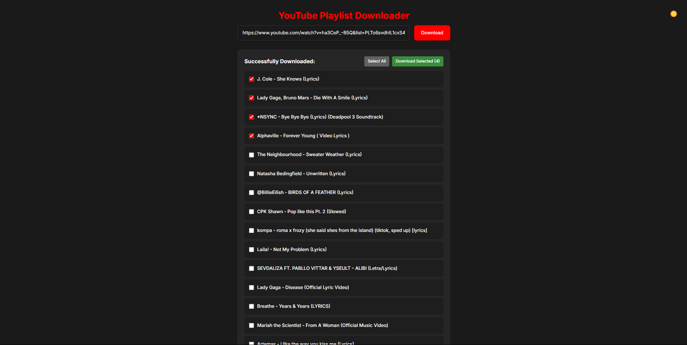

# YouTube Playlist Downloader

A modern web application for downloading YouTube playlists with real-time progress tracking and individual file downloads.



## 🚀 Features

- Download entire YouTube playlists
- Real-time download progress tracking
- Individual video selection and download
- Light/Dark theme support
- Modern, responsive design
- Download status monitoring
- Bulk download functionality

## 🛠️ Prerequisites

- Python 3.8+
- Node.js 14+
- FFmpeg (for audio conversion)

## 📦 Installation

1. Clone the repository:
```bash
git clone https://github.com/yourusername/youtube-playlist-downloader.git
cd youtube-playlist-downloader
```

2. Set up the backend:
```bash
cd backend
python -m venv venv
# On Windows:
venv\Scripts\activate
# On Unix or MacOS:
source venv/bin/activate
pip install -r requirements.txt
```

3. Set up the frontend:
```bash
cd frontend
npm install
```

## 🚀 Running the Application

1. Start the backend server:
```bash
cd backend
# Activate virtual environment if not already activated
python app.py
```

2. Start the frontend development server:
```bash
cd frontend
npm start
```

3. Open your browser and navigate to `http://localhost:3000`

## 💡 Usage

1. Paste a YouTube playlist URL into the input field
2. Click "Download" to start downloading the playlist
3. Monitor download progress in real-time
4. Select individual videos using checkboxes
5. Use "Select All" to select all downloaded videos
6. Click "Download Selected" to download chosen videos
7. Toggle between light and dark themes using the theme button

## 🔧 Configuration

The application uses default settings optimized for audio downloads:
- Audio Format: M4A
- Quality: Best available audio quality
- Download Location: `backend/downloads/`

## 📝 Notes

- The application requires FFmpeg for audio conversion
- Downloads are limited to the first 50 videos in a playlist
- Only audio is downloaded to save bandwidth and storage

## 🔒 Security

- CORS is enabled for local development
- File paths are sanitized
- Error handling is implemented
- Secure file serving mechanism

## 🤝 Contributing

1. Fork the repository
2. Create your feature branch (`git checkout -b feature/AmazingFeature`)
3. Commit your changes (`git commit -m 'Add some AmazingFeature'`)
4. Push to the branch (`git push origin feature/AmazingFeature`)
5. Open a Pull Request

## 📄 License

This project is licensed under the MIT License - see the [LICENSE](LICENSE) file for details.

## ⚠️ Disclaimer

This tool is for personal use only. Please respect YouTube's terms of service and copyright laws.
